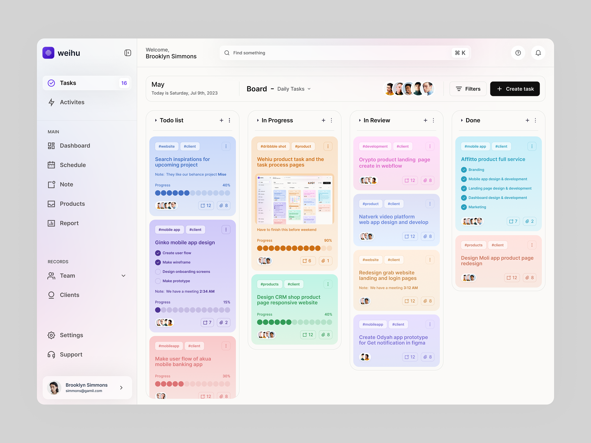

# Day 3 - Sept19

## Task 1 - Dynamic Item Manager 

**Implementation**

- Add Item: Implement functionality to add new items with a name and description.
- Remove Item: Enable removal of items from the list.
- Sort Items: Implement sorting options for items by name or description.
- Filter Items: Create a filtering mechanism based on a search term.
- Persist State: Ensure the state persists across renders and updates.

**React Hooks Usage:**
- useReducer: Manage the list of items with actions for adding and removing.
- useContext: Provide and consume item state through a context and provider.
- useState: Manage local state for form fields, search term, and sorting option.
- useEffect: Log updates whenever the item list changes.
- useRef: Automatically focus the search input field upon initial render.
- useLayoutEffect: Ensure layout adjustments (like focusing the input) happen before the screen is painted.

**Custom Hooks:**
- Create a custom hook to encapsulate filtering and sorting logic based on user input.

The work done on this can be found [here](./item-manager-app/)

## Task 2 - Dashboard Components

### Dashboard Image:

### Possible Structure for the Dashboard

#### 1. **App Level**
   - **`App.jsx`**: Entry point for routing and other global actions.
   - **`Dashboard.jsx`**: Main dashboard component that contains all sub-components, such as the sidebar, the task board etc.,

---

#### 2. **Layout Components**
   - **`Sidebar.jsx`**: Contains navigation links such as Tasks, Activities, Dashboard, Schedule, etc.
   - **`Header.jsx`**: Displays the user greeting, search bar, and icons for settings, notifications, and user profile.
   - **`TaskBoard.jsx`**: Renders all columns (To-Do, In Progress, In Review, Done) and tasks-related functions.
   
---

#### 3. **Task Board Components**
   - **`TaskBoardColumn.jsx`**: Represents individual columns (e.g., To-Do, In Progress etc.,).
   - **`TaskCard.jsx`**: Represents individual task cards within each column.
   - **`CreateTaskButton.jsx`**: The button for creating a new task.
   - **`TaskFilters.jsx`**: The button for filtering the tasks based on certain criteria.

---

#### 4. **Reusable UI Components**
   - **`Avatar.jsx`**: A component that renders the avatars for team members assigned to a task.
   - **`Tag.jsx`**: A reusable component to display the tags associated with tasks (e.g., "#Product", "#Design").
   - **`ProgressIndicator.jsx`**: For showing task progress task cards (e.g, The circles indicating the progress).
   - **`TaskMenu.jsx`**: For rendering options like edit, delete, etc., on each task card.